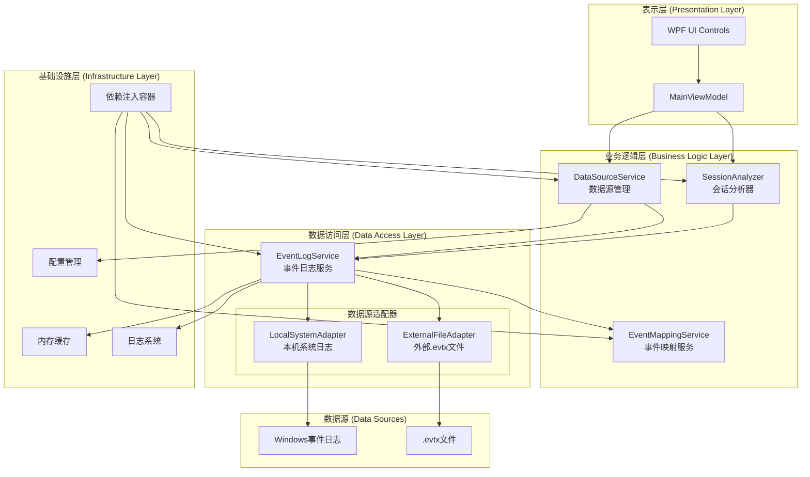

# TurnedOnTimesView 多数据源架构设计

## 架构概览



## 核心组件设计

### 1. 数据源抽象层

#### DataSourceConfiguration (抽象基类)
- **职责**: 定义数据源配置的通用接口
- **关键特性**:
  - 类型安全的数据源配置
  - 内置验证机制
  - 支持多种数据源类型

#### LocalSystemDataSource
- **职责**: 本机Windows事件日志配置
- **特点**:
  - 权限检查支持
  - 实时数据访问
  - 高性能并发支持

#### ExternalEvtxDataSource
- **职责**: 外部.evtx文件配置
- **特点**:
  - 文件完整性验证
  - 元数据缓存
  - 大文件优化处理

### 2. 服务架构

#### IDataSourceService
```csharp
public interface IDataSourceService
{
    DataSourceConfiguration? CurrentDataSource { get; }
    event EventHandler<DataSourceChangedEventArgs>? DataSourceChanged;
    
    Task<bool> SetCurrentDataSourceAsync(DataSourceConfiguration dataSource);
    Task<DataSourceValidationResult> ValidateDataSourceAsync(DataSourceConfiguration dataSource);
    Task<UserPreferences> GetUserPreferencesAsync();
}
```

**核心功能**:
- 数据源生命周期管理
- 配置验证和性能评估
- 用户偏好设置持久化
- 最近使用文件管理

#### IEventLogService (扩展)
```csharp
public interface IEventLogService
{
    // 现有方法...
    
    Task<IReadOnlyList<SystemEvent>> GetSystemEventsAsync(
        DataSourceConfiguration dataSource,
        DateTime startDate,
        DateTime endDate,
        CancellationToken cancellationToken = default);
        
    Task<FileValidationResult> ValidateEvtxFileAsync(
        string evtxFilePath,
        CancellationToken cancellationToken = default);
}
```

**扩展特性**:
- 统一的数据源访问接口
- 异步文件验证
- 性能优化的缓存策略
- 取消操作支持

### 3. 性能优化策略

#### 缓存策略
- **本机系统日志**: 15分钟滑动缓存
- **外部文件**: 基于文件修改时间的智能缓存
- **用户偏好**: 内存缓存 + 磁盘持久化

#### 文件读取优化
```csharp
// 大文件分批处理
private const int LargeFileBatchSize = 500;
private const int StandardBatchSize = 1000;

// 基于文件大小动态调整批处理大小
var batchSize = fileSize > 50 * 1024 * 1024 ? LargeFileBatchSize : StandardBatchSize;
```

#### 并发控制
- **本机系统**: 支持多线程并行读取
- **外部文件**: 单线程顺序读取（避免文件锁冲突）
- **事件处理**: Channel + 生产者-消费者模式

### 4. 错误处理和容错

#### 分层错误处理
1. **数据访问层**: EventLogException, SecurityException
2. **业务逻辑层**: ValidationException, ConfigurationException
3. **表示层**: 用户友好的错误提示

#### 容错机制
- 文件访问失败时的优雅降级
- 权限不足时的警告提示
- 网络中断时的重试机制
- 内存不足时的批量处理降级

### 5. 向后兼容性

#### 接口兼容
- 保留所有现有的IEventLogService方法
- 新增方法使用默认参数确保兼容性
- SessionAnalyzer无需修改

#### 数据兼容
- 现有的SystemEvent模型保持不变
- SessionRecord结构完全兼容
- 配置文件平滑迁移

## 使用示例

### 基本用法

```csharp
// 注入服务
public MainViewModel(IDataSourceService dataSourceService, IEventLogService eventLogService)
{
    _dataSourceService = dataSourceService;
    _eventLogService = eventLogService;
}

// 使用本机系统日志
var localDataSource = _dataSourceService.CreateLocalSystemDataSource();
await _dataSourceService.SetCurrentDataSourceAsync(localDataSource);

// 使用外部.evtx文件
var evtxDataSource = await _dataSourceService.CreateExternalEvtxDataSourceAsync(
    @"C:\Logs\System.evtx", 
    "系统日志备份");
await _dataSourceService.SetCurrentDataSourceAsync(evtxDataSource);

// 获取事件数据
var events = await _eventLogService.GetSystemEventsAsync(
    _dataSourceService.CurrentDataSource!,
    DateTime.Now.AddDays(-30),
    DateTime.Now);
```

### 高级配置

```csharp
// 验证数据源
var validationResult = await _dataSourceService.ValidateDataSourceAsync(dataSource);
if (!validationResult.IsValid)
{
    // 处理验证错误
    ShowError(validationResult.ErrorMessage);
    return;
}

// 检查性能警告
if (validationResult.PerformanceInfo?.EstimatedAccessTimeMs > 5000)
{
    var result = ShowWarning("文件较大，读取可能需要较长时间，是否继续？");
    if (!result) return;
}

// 监听数据源变更
_dataSourceService.DataSourceChanged += (sender, e) =>
{
    UpdateUI($"数据源已切换: {e.NewDataSource?.DisplayName}");
};
```

## 部署和扩展

### 新数据源类型扩展
1. 继承`DataSourceConfiguration`创建新的配置类
2. 在`EventLogService`中添加对应的处理逻辑
3. 更新`DataSourceService`的验证逻辑
4. 在UI中添加相应的选择界面

### 配置管理
- 用户偏好存储在: `%LocalAppData%\TurnedOnTimesView\user-preferences.json`
- 支持导入/导出配置
- 多用户配置隔离

### 监控和诊断
- 详细的结构化日志
- 性能计数器
- 内存使用监控
- 文件访问统计

## 技术栈

- **.NET 9.0**: 现代C#语言特性
- **System.Diagnostics.Eventing.Reader**: Windows事件日志API
- **Microsoft.Extensions.DependencyInjection**: 依赖注入
- **Microsoft.Extensions.Caching.Memory**: 内存缓存
- **Microsoft.Extensions.Logging**: 结构化日志
- **System.Text.Json**: 配置序列化
- **System.Threading.Channels**: 高性能异步处理

## 性能指标

### 预期性能
- **本机系统日志**: < 500ms (30天数据)
- **小型.evtx文件** (< 10MB): < 1s
- **大型.evtx文件** (100MB+): < 30s
- **内存占用**: < 100MB (典型场景)

### 扩展性
- **支持的文件大小**: 理论上无限制
- **并发用户**: 单用户桌面应用
- **数据量**: 支持数十万条事件记录
- **时间跨度**: 支持数年历史数据