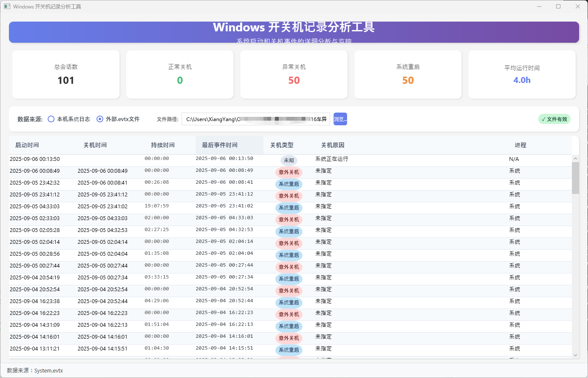

# TurnedOnTimesView

<div align="center">

**Windows 开关机记录分析工具**

*分析Windows事件日志，显示计算机开关机记录和会话统计信息*

[](https://dotnet.microsoft.com/download/dotnet/9.0)
[](https://docs.microsoft.com/en-us/dotnet/desktop/wpf/)
[](https://www.microsoft.com/windows)
[](LICENSE)

</div>



## 📖 简介

TurnedOnTimesView 是一个专业的Windows系统开关机记录分析工具，通过分析Windows事件日志来追踪和统计计算机的使用情况。该工具提供了直观的WPF界面，支持本地系统日志分析和外部.evtx文件导入，帮助用户了解系统使用模式、异常关机情况以及会话持续时间等重要信息。

## ✨ 主要特性

### 🔍 数据源支持
- **本地系统日志** - 直接读取当前系统的Windows事件日志
- **外部文件导入** - 支持导入和分析.evtx事件日志文件
- **自动权限检测** - 智能检测管理员权限，提供权限提升建议

### 📊 会话分析功能
- **开关机记录追踪** - 精确记录每次开机和关机时间
- **会话类型识别** - 区分正常关机、异常关机、睡眠唤醒等会话类型
- **持续时间统计** - 计算每个会话的持续时间和系统使用模式
- **异常检测** - 识别意外关机、系统崩溃等异常情况

### 📈 统计与导出
- **详细统计信息** - 提供总会话数、正常关机、异常关机等统计数据
- **多格式导出** - 支持CSV、Excel、HTML格式数据导出
- **时间范围筛选** - 可自定义分析时间范围（默认150天）
- **实时刷新** - 支持自动刷新和手动刷新数据

### 🛠️ 技术特性
- **现代.NET架构** - 基于.NET 9和WPF构建的现代桌面应用
- **MVVM模式** - 采用CommunityToolkit.Mvvm实现清晰的架构分离
- **依赖注入** - 使用Microsoft.Extensions.DependencyInjection实现松耦合设计
- **结构化日志** - 集成Serilog提供详细的运行日志
- **异常处理** - 完善的异常处理机制和错误追踪系统
- **内存缓存** - 使用内存缓存提升数据访问性能

## 🚀 快速开始

### 系统要求

- **操作系统**: Windows 10 版本 1903 或更高版本
- **运行时**: .NET 9.0 Runtime (Windows Desktop)
- **权限要求**: 访问系统事件日志需要管理员权限（推荐）

### 安装方式

#### 方式一：从发布版本安装
1. 从 [Releases](https://github.com/your-username/TurnedOnTimesView/releases) 页面下载最新版本
2. 解压缩到任意目录
3. 以管理员身份运行 `TurnedOnTimesView.exe`

#### 方式二：从源码构建
```bash
# 克隆仓库
git clone https://github.com/your-username/TurnedOnTimesView.git
cd TurnedOnTimesView

# 还原依赖
dotnet restore

# 编译项目
dotnet build --configuration Release

# 运行程序
cd src/TurnedOnTimesView
dotnet run
```

### 基本使用

1. **启动应用程序**
   - 建议以管理员权限运行以获取完整的系统日志访问权限
   - 首次运行会显示权限说明和使用指南

2. **选择数据源**
   - **本地系统日志**: 分析当前计算机的事件日志
   - **外部文件**: 导入其他计算机导出的.evtx文件进行分析

3. **查看分析结果**
   - 系统会自动分析选定时间范围内的所有开关机记录
   - 显示详细的会话列表，包括开机时间、关机时间、持续时间等
   - 提供统计摘要，包括总会话数、正常/异常关机次数等

4. **导出数据**
   - 支持将分析结果导出为CSV、Excel或HTML格式
   - 可用于进一步分析或生成报告

## 🏗️ 技术架构

### 架构概览

```
┌─────────────────┐    ┌─────────────────┐    ┌─────────────────┐
│   Presentation  │    │    Business     │    │  Infrastructure │
│     Layer       │    │     Layer       │    │     Layer       │
├─────────────────┤    ├─────────────────┤    ├─────────────────┤
│  • WPF Views    │    │ • Session       │    │ • Event Log     │
│  • ViewModels   │    │   Analyzer      │    │   Access        │
│  • Converters   │    │ • Data Source   │    │ • Logging       │
│  • Commands     │    │   Service       │    │ • Caching       │
└─────────────────┘    │ • Mapping       │    │ • Exception     │
                       │   Service       │    │   Handling      │
                       └─────────────────┘    └─────────────────┘
```

### 核心组件

#### 🎯 业务逻辑层
- **SessionAnalyzer**: 核心会话分析引擎，负责解析事件日志并生成会话记录
- **DataSourceService**: 数据源管理服务，支持本地和外部数据源切换
- **EventMappingService**: 事件映射服务，将Windows事件ID映射为可读的描述信息

#### 🔧 基础设施层
- **EventLogService**: Windows事件日志访问服务，提供统一的日志读取接口
- **ErrorTracker**: 错误追踪系统，记录和管理应用程序运行时错误
- **RetryPolicy**: 重试策略实现，提供网络和文件访问的容错机制

#### 🎨 表示层
- **MainViewModel**: 主界面视图模型，实现MVVM模式的数据绑定
- **DataSourceSelector**: 数据源选择组件，提供直观的数据源切换界面

### 依赖包说明

| 包名 | 版本 | 用途 |
|-----|------|-----|
| **CommunityToolkit.Mvvm** | 8.2.2 | MVVM框架，提供ViewModel基类和命令绑定 |
| **Serilog** | 3.1.1 | 结构化日志记录，支持多种输出目标 |
| **Microsoft.Extensions.Hosting** | 8.0.0 | 依赖注入和应用生命周期管理 |
| **System.Diagnostics.EventLog** | 8.0.0 | Windows事件日志访问API |
| **EPPlus** | 7.0.10 | Excel文件生成和处理 |
| **CsvHelper** | 30.0.1 | CSV文件读写操作 |

## 📁 项目结构

```
TurnedOnTimesView/
├── src/
│   ├── TurnedOnTimesView/              # 主应用程序项目
│   │   ├── Views/                      # WPF视图文件
│   │   │   ├── MainWindow.xaml         # 主窗口界面
│   │   │   └── ErrorDialog.xaml       # 错误对话框
│   │   ├── ViewModels/                 # MVVM视图模型
│   │   │   └── MainViewModel.cs        # 主界面业务逻辑
│   │   ├── Core/                       # 核心业务逻辑
│   │   │   ├── SessionAnalyzer.cs      # 会话分析引擎
│   │   │   └── ISessionAnalyzer.cs     # 分析器接口
│   │   ├── Services/                   # 业务服务
│   │   │   ├── EventLogService.cs      # 事件日志服务
│   │   │   ├── DataSourceService.cs    # 数据源管理服务
│   │   │   └── EventMappingService.cs  # 事件映射服务
│   │   ├── Infrastructure/             # 基础设施
│   │   │   ├── Configuration/          # 配置管理
│   │   │   ├── Logging/                # 日志系统
│   │   │   ├── Exceptions/             # 异常处理
│   │   │   ├── Resilience/             # 重试策略
│   │   │   └── DependencyInjection/    # 依赖注入配置
│   │   ├── Models/                     # 数据模型
│   │   ├── Converters/                 # WPF值转换器
│   │   └── Examples/                   # 示例和演示代码
│   └── RecordExtractor/                # 命令行工具项目
├── tests/                              # 单元测试和集成测试
│   ├── TurnedOnTimesView.Tests/        # 单元测试
│   └── TurnedOnTimesView.IntegrationTests/ # 集成测试
├── docs/                               # 项目文档
└── README.md                           # 项目说明文档
```

## 🔧 配置说明

### appsettings.json 配置

```json
{
  "Logging": {
    "LogLevel": {
      "Default": "Information",
      "TurnedOnTimesView": "Debug"
    }
  },
  "App": {
    "DefaultDateRange": 150,           // 默认查询天数
    "MaxRecordsToLoad": 10000,         // 最大记录加载数量
    "RefreshIntervalMinutes": 5,       // 自动刷新间隔(分钟)
    "ExportFormats": ["CSV", "Excel", "HTML"]  // 支持的导出格式
  }
}
```

### 日志配置

应用程序使用Serilog进行日志记录，支持以下输出：
- **控制台输出**: 开发和调试时的实时日志
- **文件输出**: 存储在 `logs/app-{date}.log`，按日滚动，保留30天

## 🚨 故障排除

### 常见问题

#### 1. 权限不足错误
**问题**: 无法访问Windows事件日志
**解决方案**: 
- 以管理员身份运行应用程序
- 或使用外部.evtx文件作为数据源

#### 2. 数据加载缓慢
**问题**: 分析大量历史数据时响应缓慢
**解决方案**:
- 减少查询时间范围
- 调整 `MaxRecordsToLoad` 配置参数
- 确保系统有足够的可用内存

#### 3. 导出功能异常
**问题**: 无法导出分析结果
**解决方案**:
- 检查目标目录的写入权限
- 确保磁盘空间充足
- 查看应用程序日志了解详细错误信息

### 日志查看

应用程序运行日志位于：
- **Windows**: `%LOCALAPPDATA%\\TurnedOnTimesView\\logs\\`
- **开发环境**: `项目根目录\\logs\\`

## 🤝 贡献指南

我们欢迎任何形式的贡献！请参考以下步骤：

1. **Fork** 本仓库
2. 创建您的功能分支 (`git checkout -b feature/AmazingFeature`)
3. 提交您的更改 (`git commit -m 'Add some AmazingFeature'`)
4. 推送到分支 (`git push origin feature/AmazingFeature`)
5. 打开一个 **Pull Request**

### 开发环境设置

```bash
# 1. 克隆仓库
git clone https://github.com/your-username/TurnedOnTimesView.git
cd TurnedOnTimesView

# 2. 安装依赖
dotnet restore

# 3. 运行测试
dotnet test

# 4. 启动开发服务器
cd src/TurnedOnTimesView
dotnet run
```

## 📄 许可证

本项目采用 MIT 许可证 - 查看 [LICENSE](LICENSE) 文件了解详情。

## 👥 作者

- **开发者** - [Your Name](https://github.com/your-username)

## 🙏 致谢

- 感谢 [Microsoft](https://microsoft.com) 提供的.NET框架和WPF技术
- 感谢 [Serilog](https://serilog.net/) 社区提供的优秀日志框架
- 感谢所有为开源软件做出贡献的开发者们

## 📞 支持

如果您遇到问题或有任何建议，请通过以下方式联系我们：

- 🐛 [提交问题](https://github.com/your-username/TurnedOnTimesView/issues)
- 💬 [讨论区](https://github.com/your-username/TurnedOnTimesView/discussions)
- 📧 [邮件联系](mailto:your-email@example.com)

---

<div align="center">

**感谢使用 TurnedOnTimesView！**

如果这个工具对您有帮助，请给我们一个 ⭐️

</div>